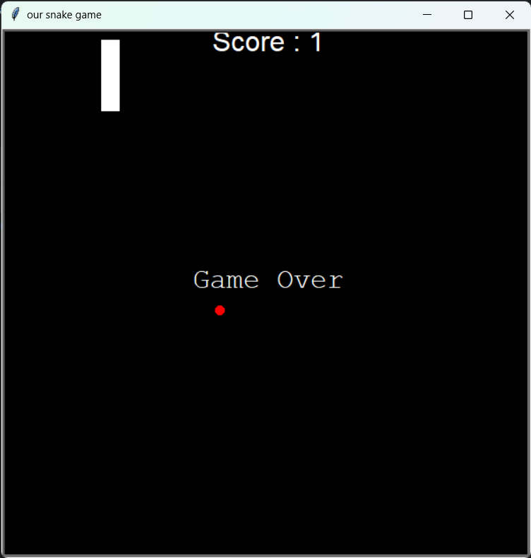
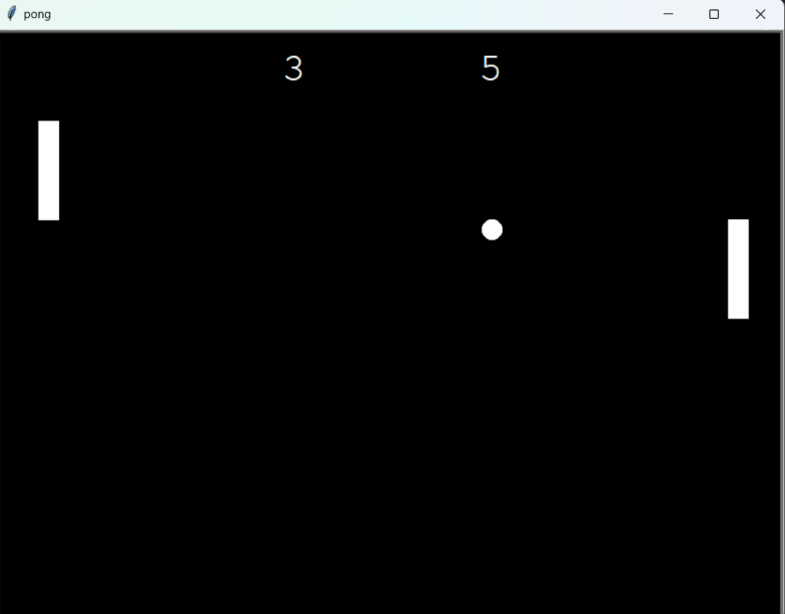
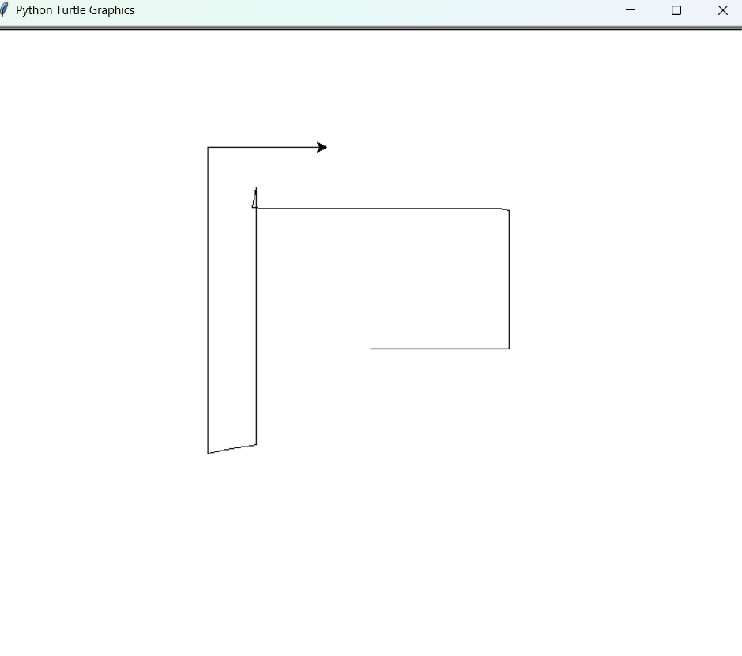
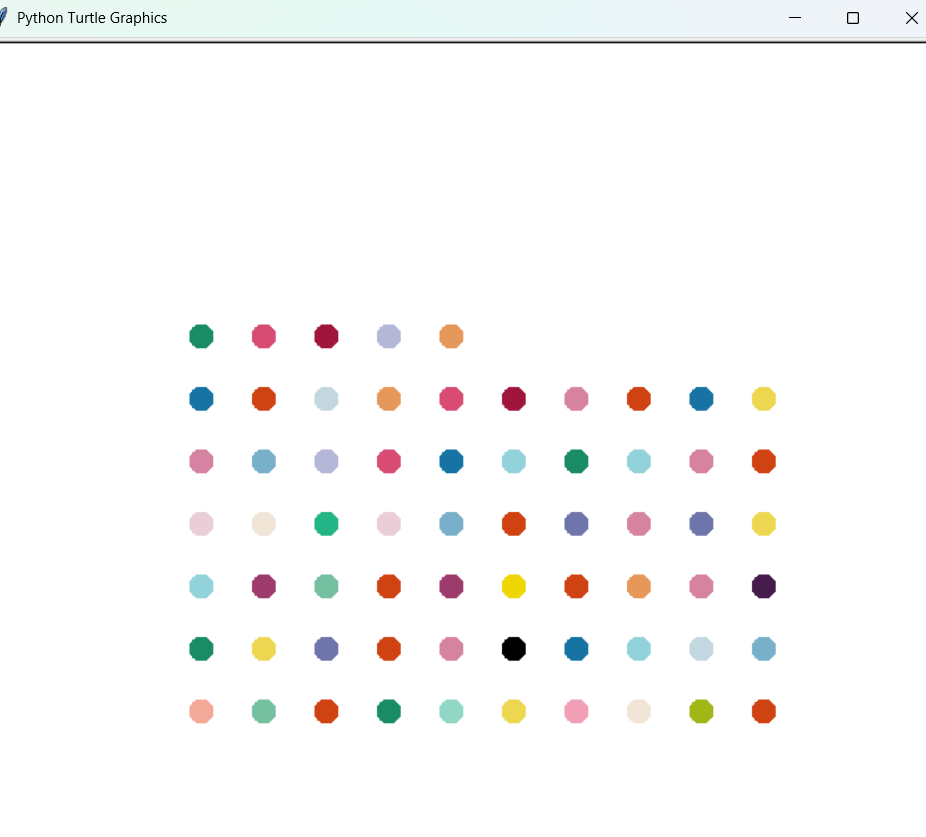

## Some Intermediate projects Outputs

## Snakegame:
#### Instruction
- Click Key 'W' for up
- Click Key 'S' for down
- Click Key 'A' for left
- Click Key 'D' for right

If snake touches the boarder or collide with own body, the 'Game Over'.

## PongGame
#### Instruction
for right pong
- Click Key 'W' for up
- Click Key 'S' for down
- Click Key 'A' for left
- Click Key 'D' for right

for left pong 
-Click the arrow following the direction

If you are unable to hit the pong you will increase by 1 score and the one with higher score loses the game.

## Cursor Direction
To move cursor

- Click Key 'W' for up
- Click Key 'S' for down
- Click Key 'A' for left
- Click Key 'D' for right

## Hrist paint
-Random circle color generating paint that automatically run and generates square shape.

